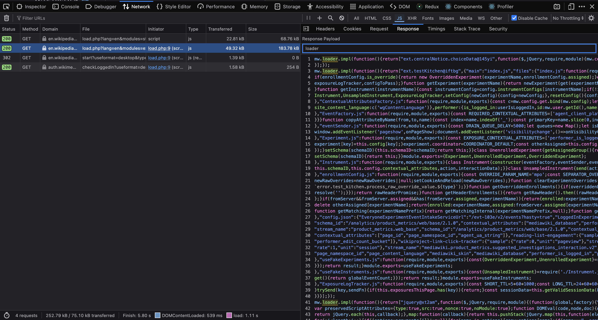
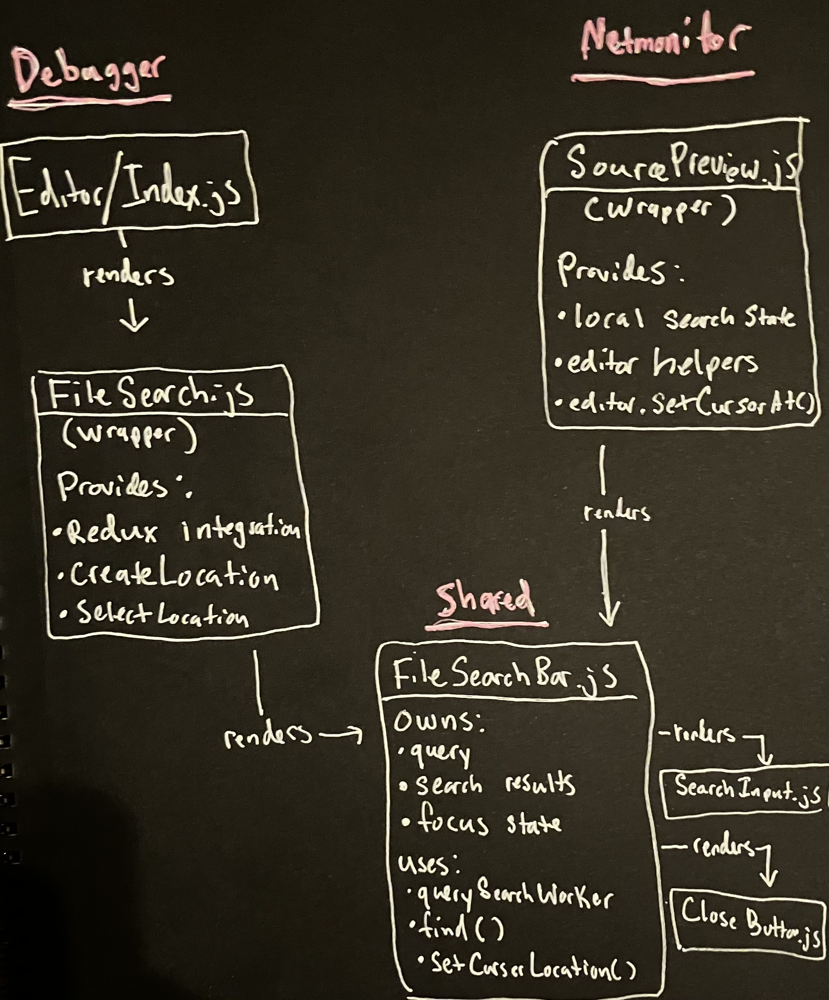
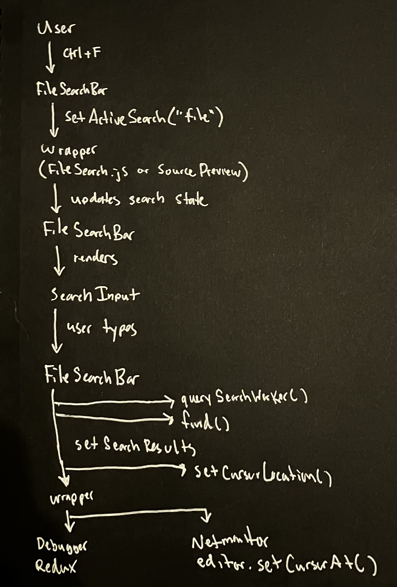

# Mozilla Contributions

This page highlights selected contributions to Firefox DevTools and related modules.  
Work includes shared component architecture, NetMonitor and Debugger improvements, legacy widget fixes, accessibility-related component work, and JavaScript codebase modernization.

Last updated: 07-17-2026

**Latest landed Firefox commits:**

https://github.com/mozilla-firefox/firefox/commits?author=Chris-Vander-Linden&since=2024-03-01

**Bugzilla activity:**

https://bugzilla.mozilla.org/user_profile?user_id=766005

**Phabricator revisions:**

https://phabricator.services.mozilla.com/p/cvl123abc/

---

# Search / Debugger Shared Components Project

A multi-stage project focused on decoupling file-search components from the Firefox Debugger so they can be reused elsewhere in DevTools.

The first phase moved the primary search interface and its supporting components into shared DevTools directories, relocated localization strings, preserved the Debugger integration through a wrapper, and updated module dependencies.

The current phase integrates the shared `FileSearchBar` into the NetMonitor Source Preview and adds browser-level test coverage.

## Phase 1 — Shared Component Architecture

## Bug 2019256 — Move SearchInFileBar to shared and add Debugger wrapper

Commit: https://github.com/mozilla-firefox/firefox/commit/c8390b5d99a9  
Bugzilla: https://bugzilla.mozilla.org/show_bug.cgi?id=2019256  
Phabricator: https://phabricator.services.mozilla.com/D278736  

## Bug 2020518 — Move file-search locale strings to shared component properties

Commit: https://github.com/mozilla-firefox/firefox/commit/fe85ac5c2ef5  
Bugzilla: https://bugzilla.mozilla.org/show_bug.cgi?id=2020518  
Phabricator: https://phabricator.services.mozilla.com/D285978  

## Bug 2019260 — Move SearchInput to shared components

Commit: https://github.com/mozilla-firefox/firefox/commit/a73a3f85d74d  
Bugzilla: https://bugzilla.mozilla.org/show_bug.cgi?id=2019260  
Phabricator: https://phabricator.services.mozilla.com/D286439  

## Bug 2027580 — Move DebuggerImage to shared components

Commit: https://github.com/mozilla-firefox/firefox/commit/8c8db126be85  
Bugzilla: https://bugzilla.mozilla.org/show_bug.cgi?id=2027580  
Phabricator: https://phabricator.services.mozilla.com/D292685  

## Bug 2027582 — Move CloseButton to shared components

Commit: https://github.com/mozilla-firefox/firefox/commit/f391b5327398  
Bugzilla: https://bugzilla.mozilla.org/show_bug.cgi?id=2027582  
Phabricator: https://phabricator.services.mozilla.com/D292686  

## Phase 2 — NetMonitor Source Preview Integration

## Bug 1941575 — Reuse shared FileSearchBar in NetMonitor Source Preview

Status: In review / development  
Bugzilla: https://bugzilla.mozilla.org/show_bug.cgi?id=1941575  
Phabricator: https://phabricator.services.mozilla.com/D310553  

This phase integrates the reusable file-search interface into NetMonitor’s source-response preview.

The work includes:

- Connecting the shared search components to the NetMonitor source editor
- Supporting keyboard-based search activation
- Supporting result navigation
- Supporting case-sensitive, whole-word, and regular-expression searches
- Adding browser mochitest coverage
- Addressing accessibility requirements for shared controls

A landed commit link will be added after the revision reaches the official Firefox `main` branch.

## Before Fix (Network panel uses basic searchbar)

## After Fix (Network panel uses shared searchbar)

## Architecture

## Search Flow

---

# TableWidget / Legacy DevTools Work

Work involving older DevTools widgets created before the current React-based architecture.

These changes required working with manual DOM updates, widget lifecycle behavior, layout synchronization, and backward-compatible accessors.

## Bug 1888847 — Synchronize TableWidget row heights

Commit: https://github.com/mozilla-firefox/firefox/commit/a0c98e624cb4  
Bugzilla: https://bugzilla.mozilla.org/show_bug.cgi?id=1888847  
Phabricator: https://phabricator.services.mozilla.com/D244451  

## Bug 2015241 — Convert TableWidget internals to private fields

Commit: https://github.com/mozilla-firefox/firefox/commit/e3d815475858  
Bugzilla: https://bugzilla.mozilla.org/show_bug.cgi?id=2015241  
Phabricator: https://phabricator.services.mozilla.com/D283630  

---

# DevTools Framework Modernization

JavaScript modernization work converting internal implementation details to native private class fields while preserving the public interfaces used by other DevTools modules.

## Bug 2022409 — Use private class fields in toolbox.js

Commit: https://github.com/mozilla-firefox/firefox/commit/cf7286eac1af  
Bugzilla: https://bugzilla.mozilla.org/show_bug.cgi?id=2022409  
Phabricator: https://phabricator.services.mozilla.com/D290756  

## Bug 2022407 — Use private class fields in toolbox-host-manager.js

Commit: https://github.com/mozilla-firefox/firefox/commit/a5f35299e543  
Bugzilla: https://bugzilla.mozilla.org/show_bug.cgi?id=2022407  
Phabricator: https://phabricator.services.mozilla.com/D288555  

## Bug 2022406 — Use private class fields in source-map-url-service.js

Commit: https://github.com/mozilla-firefox/firefox/commit/4d1c457b80f3  
Bugzilla: https://bugzilla.mozilla.org/show_bug.cgi?id=2022406  
Phabricator: https://phabricator.services.mozilla.com/D288554  

## Bug 2022405 — Use private class fields in devtools.js

Commit: https://github.com/mozilla-firefox/firefox/commit/a453ba35a8d8  
Bugzilla: https://bugzilla.mozilla.org/show_bug.cgi?id=2022405  
Phabricator: https://phabricator.services.mozilla.com/D288553  

## Bug 2022403 — Use private class fields in ToolboxTabs

Commit: https://github.com/mozilla-firefox/firefox/commit/f54886160973  
Bugzilla: https://bugzilla.mozilla.org/show_bug.cgi?id=2022403  
Phabricator: https://phabricator.services.mozilla.com/D288552  

---

# Debugger Modernization

## Bug 2022402 — Use private class fields in XHRBreakpoints

Commit: https://github.com/mozilla-firefox/firefox/commit/6d6070bdda16  
Bugzilla: https://bugzilla.mozilla.org/show_bug.cgi?id=2022402  
Phabricator: https://phabricator.services.mozilla.com/D288551  

## Bug 2022400 — Use private class fields in Expressions

Commit: https://github.com/mozilla-firefox/firefox/commit/eb04ab8ea8fe  
Bugzilla: https://bugzilla.mozilla.org/show_bug.cgi?id=2022400  
Phabricator: https://phabricator.services.mozilla.com/D288550  

---

# NetMonitor Modernization

A coordinated set of changes converting implementation details across NetMonitor modules to native JavaScript private fields.

## Bug 2021639 — Use private fields in NetMonitor API

Commit: https://github.com/mozilla-firefox/firefox/commit/ef688059c83c  
Bugzilla: https://bugzilla.mozilla.org/show_bug.cgi?id=2021639  
Phabricator: https://phabricator.services.mozilla.com/D286550  

## Bug 2021640 — Use private fields in NetMonitor connector

Commit: https://github.com/mozilla-firefox/firefox/commit/6be35ddc3764  
Bugzilla: https://bugzilla.mozilla.org/show_bug.cgi?id=2021640  
Phabricator: https://phabricator.services.mozilla.com/D286588  

## Bug 2021641 — Use private fields in RequestListHeader

Commit: https://github.com/mozilla-firefox/firefox/commit/34bc985e6919  
Bugzilla: https://bugzilla.mozilla.org/show_bug.cgi?id=2021641  
Phabricator: https://phabricator.services.mozilla.com/D286558  

## Bug 2021642 — Use private fields in firefox-data-provider

Commit: https://github.com/mozilla-firefox/firefox/commit/923e0ff07073  
Bugzilla: https://bugzilla.mozilla.org/show_bug.cgi?id=2021642  
Phabricator: https://phabricator.services.mozilla.com/D286587  

## Bug 2021643 — Use private fields in har-builder

Commit: https://github.com/mozilla-firefox/firefox/commit/0f74d3a9e73b  
Bugzilla: https://bugzilla.mozilla.org/show_bug.cgi?id=2021643  
Phabricator: https://phabricator.services.mozilla.com/D286568  

## Bug 2021644 — Use private fields in STOMP frame parser

Commit: https://github.com/mozilla-firefox/firefox/commit/f9adf6e95b6f  
Bugzilla: https://bugzilla.mozilla.org/show_bug.cgi?id=2021644  
Phabricator: https://phabricator.services.mozilla.com/D286554  

## Bug 2021645 — Use private fields in STOMP message parser

Commit: https://github.com/mozilla-firefox/firefox/commit/ec73bcd7fd90  
Bugzilla: https://bugzilla.mozilla.org/show_bug.cgi?id=2021645  
Phabricator: https://phabricator.services.mozilla.com/D286564  

---

# Accessibility Panel Modernization

## Bug 2013442 — Use private class fields in accessibility-proxy.js

Commit: https://github.com/mozilla-firefox/firefox/commit/ba48474d521d  
Bugzilla: https://bugzilla.mozilla.org/show_bug.cgi?id=2013442  
Phabricator: https://phabricator.services.mozilla.com/D281141  

## Bug 2015237 — Use private class fields in AccessibilityRow

Commit: https://github.com/mozilla-firefox/firefox/commit/8ba3f161a42e  
Bugzilla: https://bugzilla.mozilla.org/show_bug.cgi?id=2015237  
Phabricator: https://phabricator.services.mozilla.com/D282287  

## Bug 2015238 — Use private fields in AccessibilityPanel and expose toolbox through a getter

Commit: https://github.com/mozilla-firefox/firefox/commit/8f615d0ac355  
Bugzilla: https://bugzilla.mozilla.org/show_bug.cgi?id=2015238  
Phabricator: https://phabricator.services.mozilla.com/D282747  

---

# UI Improvements

## Bug 1947950 — Truncate long font names in the Fonts panel

Commit: https://github.com/mozilla-firefox/firefox/commit/ab48338bd460  
Bugzilla: https://bugzilla.mozilla.org/show_bug.cgi?id=1947950  
Phabricator: https://phabricator.services.mozilla.com/D259902  
